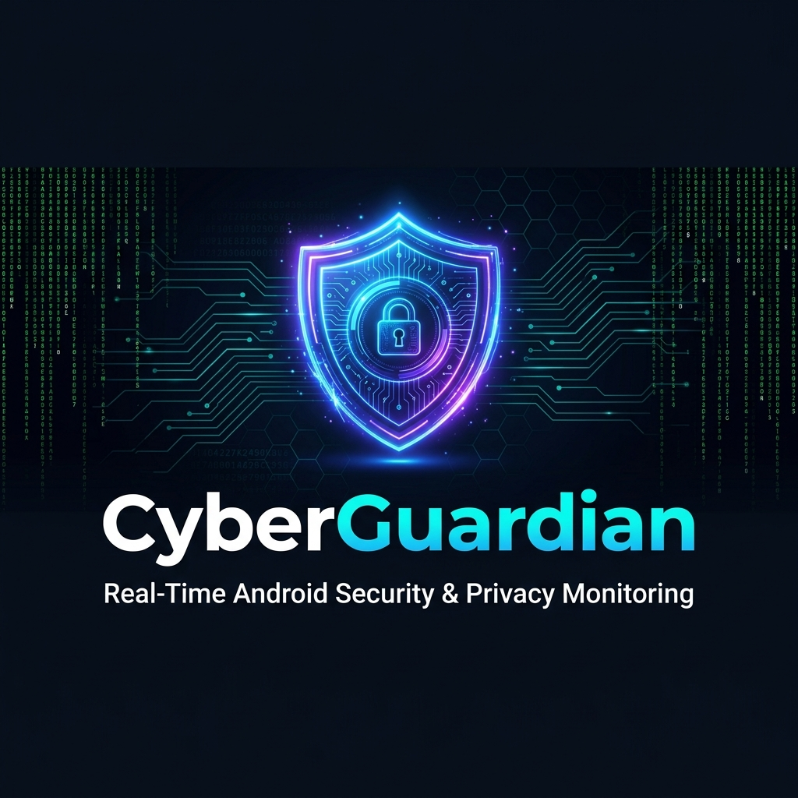
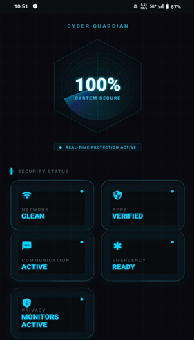

<div align="center">



# 🛡️ CyberGuardian

### Real-Time Android Security & Privacy Monitoring Application

[](https://developer.android.com)
[](https://kotlinlang.org)
[](LICENSE)
[](https://github.com/YOUR_USERNAME/CyberGuardian/stargazers)
[](https://developer.android.com/about/versions/nougat)

> **MSc Cybersecurity Capstone Project** — Advanced real-time threat detection, privacy monitoring, and network security for Android devices.

[📱 Download APK](#) · [📄 View Report](#) · [🐛 Report Bug](../../issues) · [💡 Request Feature](../../issues)

</div>

---

## ✨ Key Features

| Feature | Description |
|---|---|
| 🔍 **Real-Time Threat Detection** | Monitors device for malware, suspicious apps, and anomalies |
| 🔐 **Privacy Monitor** | Tracks camera, microphone, location, and contact access in real-time |
| 🌐 **Network Security Scanner** | Detects open ports, insecure connections, and suspicious traffic |
| 📊 **Security Dashboard** | Unified risk scoring with actionable security insights |
| 🚨 **Instant Alerts** | Push notifications for critical security events |
| 📋 **Audit Logs** | Full timestamped security event history |
| 🧠 **Risk Scoring** | Multi-vector threat analysis with severity ratings |

---

## 📸 Screenshots

> Add your screenshots to `docs/screenshots/` and they will appear here.

<div align="center">
<table>
  <tr>
    <td></td>
    <td></td>
    <td></td>
    <td></td>
  </tr>
  <tr>
    <td align="center"><b>Dashboard</b></td>
    <td align="center"><b>Privacy Monitor</b></td>
    <td align="center"><b>Network Scanner</b></td>
    <td align="center"><b>Alerts</b></td>
  </tr>
</table>
</div>

---

## 🏗️ Architecture

```
CyberGuardian/
├── app/
│   └── src/main/
│       ├── java/com/cyberguardian/
│       │   ├── ui/              # Jetpack Compose screens & ViewModels
│       │   ├── data/            # Repositories & local data sources
│       │   ├── domain/          # Use cases & business logic
│       │   ├── services/        # Background monitoring services
│       │   └── utils/           # Security utilities & helpers
│       └── res/                 # Resources, layouts & assets
├── docs/                        # Documentation, screenshots & banner
└── README.md
```

**Architecture Pattern:** MVVM + Clean Architecture  
**Key Libraries:** Jetpack Compose · Room · Hilt · Coroutines · WorkManager · Firebase

---

## 🚀 Getting Started

### Prerequisites

- Android Studio Hedgehog (2023.1.1) or later
- Android SDK API 24+
- Kotlin 1.9+
- A physical or virtual Android device

### Installation

```bash
# 1. Clone the repository
git clone https://github.com/YOUR_USERNAME/CyberGuardian.git

# 2. Open in Android Studio
# File → Open → Select the CyberGuardian folder

# 3. Let Gradle sync, then Run on your device or emulator
```

---

## 🔬 Technical Highlights

- **Real-time monitoring** via Android `AccessibilityService` and `UsageStatsManager`
- **Network analysis** using `NetworkCallback` and traffic inspection APIs
- **Privacy tracking** through `AppOpsManager` for granular permission auditing
- **Risk scoring algorithm** combining multiple independent threat vectors
- **Battery-efficient background processing** via `WorkManager` scheduled tasks
- **Secure local storage** using encrypted Room database

---

## 🛠️ Tech Stack


---

## 📄 Academic Context

Developed as part of an **MSc in Cybersecurity** dissertation, demonstrating:
- ✅ Practical application of Android security APIs
- ✅ Real-time threat intelligence implementation  
- ✅ Privacy-first mobile application design principles
- ✅ MVVM Clean Architecture with Kotlin best practices
- ✅ Ethical security monitoring with user transparency

---

## 📜 License

Distributed under the MIT License. See [`LICENSE`](LICENSE) for more information.

---

<div align="center">

Made with ❤️ by **[Your Name](https://github.com/YOUR_USERNAME)**  
⭐ Star this repo if you found it useful!

</div>
